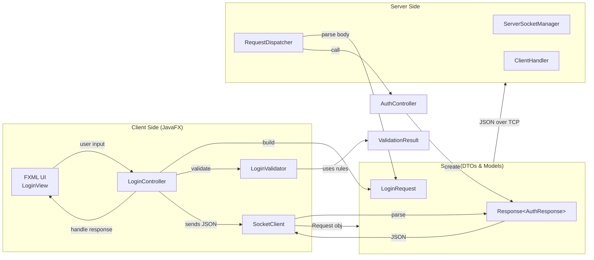
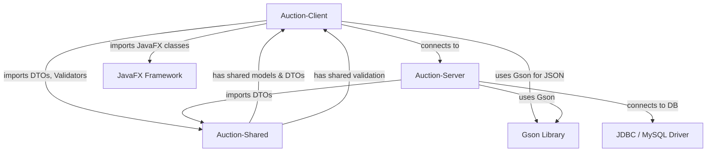
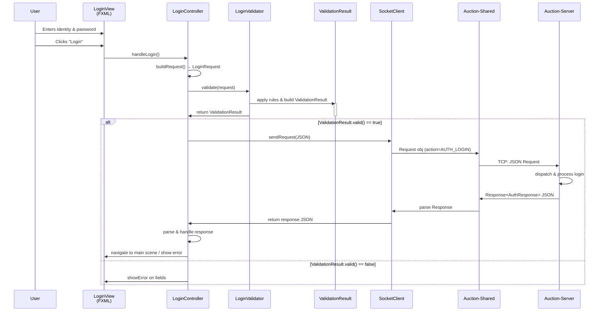

# UML Diagram: Auction-Client Architecture

## 1. Class Diagram - Toàn bộ cấu trúc

```mermaid
graph TB
    subgraph "Auction-Shared (shared module)"
        Request["<<DTO>><br/>Request<br/>---<br/>-action: String<br/>-body: String<br/>---<br/>+getAction(): String<br/>+getBody(): String"]
        Response["<<Generic DTO>><br/>Response&lt;T&gt;<br/>---<br/>-success: boolean<br/>-message: String<br/>-data: T<br/>---<br/>+isSuccess(): boolean<br/>+getMessage(): String<br/>+getData(): T<br/>+success(msg, data): Response&lt;T&gt;<br/>+fail(msg): Response&lt;T&gt;"]
        
        User["<<Entity>><br/>User<br/>---<br/>-id: Long<br/>-fullName: String<br/>-username: String<br/>-email: String<br/>-phone: String<br/>-dateOfBirth: String<br/>-passwordHash: String<br/>-role: String"]
        
        PasswordResetToken["<<Entity>><br/>PasswordResetToken<br/>---<br/>-id: Long<br/>-userId: Long<br/>-token: String<br/>-expiredAt: LocalDateTime<br/>-used: boolean"]
        
        Validator["<<Interface>><br/>Validator&lt;T&gt;<br/>---<br/>+validate(T): ValidationResult"]
        
        ValidationResult["<<Value Object>><br/>ValidationResult<br/>---<br/>-fieldErrors: Map&lt;String, String&gt;<br/>---<br/>+valid(): boolean<br/>+errorFor(field): String<br/>+hasErrorFor(field): boolean<br/>+ok(): ValidationResult<br/>+from(errors): ValidationResult"]
        
        FieldError["<<Record>><br/>FieldError<br/>---<br/>+field(): String<br/>+message(): String"]
        
        ValidationRule["<<Interface>><br/>ValidationRule&lt;T&gt;<br/>---<br/>+validate(value): Optional&lt;String&gt;"]
        
        FieldValidator["<<Utility>><br/>FieldValidator&lt;T&gt;<br/>---<br/>-fieldName: String<br/>-value: T<br/>-rules: ValidationRule&lt;T&gt;[]<br/>---<br/>+validate(): Optional&lt;FieldError&gt;"]
    end

    subgraph "Auction-Client (client module)"
        subgraph "Network Layer"
            SocketClient["<<Client>><br/>SocketClient<br/>---<br/>-socket: Socket<br/>-reader: BufferedReader<br/>-writer: PrintWriter<br/>---<br/>+connect(): void<br/>+sendRequest(json): String"]
        end
        
        subgraph "Feature: Auth"
            subgraph "Controller"
                LoginController["LoginController(FXML Controller)<br/>---<br/>-identityField: TextField<br/>-passwordField: PasswordField<br/>-fieldErrorMap: Map&lt;Control, Label&gt;<br/>-fieldMap: Map&lt;String, Control&gt;<br/>-validator: Validator&lt;LoginRequest&gt;<br/>---<br/>+initialize(): void<br/>+handleLogin(event): void<br/>+handleNavigateRegister(event): void<br/>+handleNavigateForgotPassword(event): void<br/>-buildRequest(): LoginRequest<br/>-navigateToMain(): void"]
                
                RegisterController["RegisterController"]
                ForgotPasswordController["ForgotPasswordController"]
                HomeController["HomeController"]
            end
            
            subgraph "Service"
                AuthServiceImpl["<<Interface>><br/>AuthService<br/>---<br/>+login(username, pwd): AuthResponse<br/>---<br/><<Implementation>><br/>AuthServiceImpl"]
                AuthValidator["<<Utility>><br/>AuthValidator<br/>---<br/>-AuthValidator(): BLOCKED<br/>---<br/>+validateLogin(user, pwd): String<br/>-checkUserName(user): String<br/>-checkPassword(pwd): String"]
            end
            
            subgraph "Validator"
                LoginValidator["LoginValidator<br/>implements Validator&lt;LoginRequest&gt;<br/>---<br/>+validate(req): ValidationResult"]
                RegisterValidator["RegisterValidator<br/>implements Validator&lt;RegisterRequest&gt;<br/>---<br/>+validate(req): ValidationResult"]
                ForgotPasswordValidator["ForgotPasswordValidator<br/>implements Validator&lt;ForgotPasswordRequest&gt;<br/>---<br/>+validate(req): ValidationResult"]
                OtpValidator["OtpValidator<br/>implements Validator&lt;OtpRequest&gt;<br/>---<br/>+validate(req): ValidationResult"]
                ResetPasswordValidator["ResetPasswordValidator<br/>implements Validator&lt;ResetPasswordRequest&gt;<br/>---<br/>+validate(req): ValidationResult"]
            end
            
            subgraph "Factory"
                AuthValidatorFactory["<<Factory>><br/>AuthValidatorFactory<br/>---<br/>+createLoginValidator(): Validator&lt;LoginRequest&gt;<br/>+createRegisterValidator(): Validator&lt;RegisterRequest&gt;<br/>+createForgotPasswordValidator(): Validator&lt;ForgotPasswordRequest&gt;<br/>+createOtpValidator(): Validator&lt;OtpRequest&gt;<br/>+createResetPasswordValidator(): Validator&lt;ResetPasswordRequest&gt;"]
            end
            
            subgraph "DTO"
                AuthResponseDTO["<<DTO>><br/>AuthResponse<br/>---<br/>-user: UserInfo<br/>---<br/>+getUser(): UserInfo"]
                
                LoginRequest["<<Request DTO>><br/>LoginRequest<br/>---<br/>-identity: String<br/>-password: String<br/>---<br/>+identity(): String<br/>+password(): String"]
                
                RegisterRequest["<<Request DTO>><br/>RegisterRequest<br/>---<br/>-fullName: String<br/>-username: String<br/>-email: String<br/>-phone: String<br/>-dateOfBirth: String<br/>-password: String<br/>-confirmPassword: String"]
                
                ForgotPasswordRequest["<<Request DTO>><br/>ForgotPasswordRequest<br/>---<br/>-email: String"]
                
                OtpRequest["<<Request DTO>><br/>OtpRequest<br/>---<br/>-otp: String"]
                
                ResetPasswordRequest["<<Request DTO>><br/>ResetPasswordRequest<br/>---<br/>-token: String<br/>-newPassword: String<br/>-confirmPassword: String"]
                
                UserInfo["<<DTO>><br/>UserInfo<br/>---<br/>-id: Long<br/>-fullName: String<br/>-username: String<br/>-email: String<br/>-phone: String<br/>-dateOfBirth: String<br/>-role: String"]
            end
        end
        
        subgraph "Core: UI Utilities"
            SceneNavigator["<<Singleton>><br/>SceneNavigator<br/>---<br/>-mainStage: Stage<br/>-sceneCache: Map&lt;String, Scene&gt;<br/>---<br/>+setStage(stage): void<br/>+switchScene(fxmlPath): void<br/>+openModal(fxmlPath, title): void<br/>+openWindow(fxmlPath, title): void<br/>+clearCache(): void"]
            
            FormHelper["<<Utility>><br/>FormHelper<br/>---<br/>+showError(field, errorLabel, msg): void<br/>+showDatePickerError(picker, errorLabel, msg): void<br/>+applyErrors(result, fieldMap, errorMap): void<br/>+clearError(field, errorLabel): void<br/>+clearAll(fieldErrorMap): void<br/>+bindClearOnChange(fieldErrorMap): void<br/>+tryBindTextChange(field, errorLabel): void"]
            
            Toast["<<Toast Notification>><br/>Toast<br/>---<br/>+show(root, msg, type, duration, callback): void"]
            
            UIAnimations["<<Animation Utility>><br/>UIAnimations<br/>---<br/>+entrance(node): void"]
            
            AlertHelper["<<Dialog Utility>><br/>AlertHelper<br/>---<br/>+showError(title, msg): void"]
            
            PasswordStrengthBar["<<Custom Control>><br/>PasswordStrengthBar"]
        end
        
        subgraph "Main"
            MainClient["<<JavaFX Application>><br/>MainClient extends Application<br/>---<br/>+start(stage): void"]
        end
    end

    %% Relationships from Auction-Client to Auction-Shared
    LoginController -->|uses| Validator
    LoginController -->|uses| LoginValidator
    LoginController -->|uses| LoginRequest
    LoginController -->|sends via| SocketClient
    LoginController -->|uses| FormHelper
    LoginController -->|uses| SceneNavigator
    LoginController -->|uses| Toast
    
    RegisterController -->|uses| Validator
    RegisterController -->|uses| RegisterValidator
    RegisterController -->|uses| RegisterRequest
    
    ForgotPasswordController -->|uses| Validator
    ForgotPasswordController -->|uses| ForgotPasswordValidator
    ForgotPasswordController -->|uses| ForgotPasswordRequest
    
    AuthValidatorFactory -->|creates| LoginValidator
    AuthValidatorFactory -->|creates| RegisterValidator
    AuthValidatorFactory -->|creates| ForgotPasswordValidator
    AuthValidatorFactory -->|creates| OtpValidator
    AuthValidatorFactory -->|creates| ResetPasswordValidator
    
    LoginValidator -->|implements| Validator
    RegisterValidator -->|implements| Validator
    ForgotPasswordValidator -->|implements| Validator
    OtpValidator -->|implements| Validator
    ResetPasswordValidator -->|implements| Validator
    
    LoginValidator -->|uses| ValidationResult
    LoginValidator -->|uses| FieldValidator
    LoginValidator -->|uses| FieldError
    LoginValidator -->|uses| LoginRequest
    
    FieldValidator -->|uses| ValidationRule
    FieldValidator -->|returns| FieldError
    
    ValidationResult -->|contains| FieldError
    
    AuthResponseDTO -->|contains| UserInfo
    UserInfo -.->|maps from| User
    
    SocketClient -->|sends| Request
    SocketClient -->|receives| Response
    
    FormHelper -->|uses| ValidationResult
    
    MainClient -->|uses| SceneNavigator
    MainClient -->|initializes| LoginController
    
    SceneNavigator -->|manages| Stage
    
    AuthValidator -->|old static util| AuthServiceImpl
    
    %% Styling
    style Request fill:#e1f5ff
    style Response fill:#e1f5ff
    style User fill:#e1f5ff
    style PasswordResetToken fill:#e1f5ff
    style Validator fill:#f3e5f5
    style ValidationResult fill:#f3e5f5
    style FieldError fill:#f3e5f5
    style ValidationRule fill:#f3e5f5
    style FieldValidator fill:#f3e5f5
    
    style LoginController fill:#fff9c4
    style RegisterController fill:#fff9c4
    style ForgotPasswordController fill:#fff9c4
    style HomeController fill:#fff9c4
    
    style LoginValidator fill:#c8e6c9
    style RegisterValidator fill:#c8e6c9
    style ForgotPasswordValidator fill:#c8e6c9
    style OtpValidator fill:#c8e6c9
    style ResetPasswordValidator fill:#c8e6c9
    
    style AuthValidatorFactory fill:#ffccbc
    
    style SceneNavigator fill:#d1c4e9
    style FormHelper fill:#d1c4e9
    style Toast fill:#d1c4e9
    style UIAnimations fill:#d1c4e9
    style AlertHelper fill:#d1c4e9
    style PasswordStrengthBar fill:#d1c4e9
    
    style MainClient fill:#b2dfdb
    style SocketClient fill:#b2dfdb
```



---

## 2. Dependency & Data Flow Diagram



---

## 3. Design Patterns Used

### A. **Factory Pattern** (AuthValidatorFactory)
```
┌─────────────────────────────────────┐
│   AuthValidatorFactory              │
│   (Static Factory Methods)          │
├─────────────────────────────────────┤
│ + createLoginValidator()            │
│ + createRegisterValidator()         │
│ + createForgotPasswordValidator()   │
│ + createOtpValidator()              │
│ + createResetPasswordValidator()    │
└────────────────────────┬────────────┘
    │                    │
    ├──→ LoginValidator (Validator<LoginRequest>)
    ├──→ RegisterValidator (Validator<RegisterRequest>)
    ├──→ ForgotPasswordValidator (Validator<ForgotPasswordRequest>)
    ├──→ OtpValidator (Validator<OtpRequest>)
    └──→ ResetPasswordValidator (Validator<ResetPasswordRequest>)
```

### B. **Strategy Pattern** (Validator & ValidationRule)
```
LoginValidator
    ├── uses ValidationRule[]
    │   ├── NotBlankRule
    │   ├── EmailOrUsernameRule
    │   ├── PasswordRule
    │   └── ... (other rules)
    └── applies rules sequentially to validate fields
```

### C. **Singleton Pattern** (SceneNavigator)
```
SceneNavigator
    ├── private static mainStage
    ├── private static sceneCache
    └── public static setStage()
        public static switchScene()
```

### D. **Builder/Fluent Pattern** (Validation Chain)
```
LoginValidator.validate(request)
    ├── validates "identity" field with [NotBlankRule, EmailOrUsernameRule]
    ├── validates "password" field with [NotBlankRule]
    └── returns ValidationResult
```

### E. **Utility/Helper Pattern** (FormHelper, UIAnimations, AlertHelper)
```
FormHelper (static methods)
    ├── showError(field, label, message)
    ├── clearError(field, label)
    ├── applyErrors(result, fieldMap, errorMap)
    └── bindClearOnChange(fieldErrorMap)
```

---

## 4. Module Dependencies



---

## 5. Sequence Diagram: Login Flow



---

## 6. Class Relationships Summary

| From | To | Type | Purpose |
|------|-----|------|---------|
| LoginController | LoginValidator | uses | Validate login form |
| LoginValidator | ValidationResult | returns | Collect field errors |
| LoginValidator | FieldValidator | uses | Validate individual fields |
| LoginController | SocketClient | uses | Send/receive server requests |
| LoginController | FormHelper | uses | Display/clear form errors |
| LoginController | SceneNavigator | uses | Navigate between scenes |
| AuthValidatorFactory | LoginValidator | creates | Factory pattern creation |
| SocketClient | Request/Response | uses | Shared DTOs for network |
| LoginRequest | User input | represents | Data transfer object |
| UserInfo | User | maps from | Safe info for display |

---

## 7. Layer Architecture

```
┌─────────────────────────────────────────────────────┐
│            PRESENTATION LAYER (JavaFX)              │
│  LoginView.fxml ←→ LoginController                  │
│  RegisterView.fxml ←→ RegisterController            │
│  ForgotPasswordView.fxml ←→ ForgotPasswordController│
└──────────────────────┬────────────────────────────────┘
                       │
┌──────────────────────▼────────────────────────────────┐
│         VALIDATION LAYER (Auction-Shared)            │
│  Validator<T> interface                              │
│  ValidationRule<T> interface                         │
│  LoginValidator, RegisterValidator, etc.             │
│  FieldValidator, ValidationResult                    │
└──────────────────────┬────────────────────────────────┘
                       │
┌──────────────────────▼────────────────────────────────┐
│        APPLICATION/SERVICE LAYER (Client)            │
│  Factory: AuthValidatorFactory                       │
│  Services: AuthService (commented), AuthServiceImpl  │
│  Utilities: FormHelper, Toast, UIAnimations, etc.    │
└──────────────────────┬────────────────────────────────┘
                       │
┌──────────────────────▼────────────────────────────────┐
│           NETWORK LAYER (Socket)                     │
│  SocketClient.connect()                              │
│  SocketClient.sendRequest(jsonString)                │
│  Shared Request/Response DTOs                        │
│  JSON serialization via Gson                         │
└──────────────────────┬────────────────────────────────┘
                       │
              ╔════════▼════════╗
              ║ Auction-Server  ║
              ║ (Port 8888)     ║
              ╚═════════════════╝
```

---

## 8. Key Files in Structure

```
Auction-Client/src/main/java/com/auction/client/
├── MainClient.java (JavaFX Application entry point)
├── core/
│   ├── ui/
│   │   ├── SceneNavigator.java (Singleton, manages stage/scenes)
│   │   ├── FormHelper.java (Static utility for form error handling)
│   │   ├── Toast.java (Notification toasts)
│   │   ├── UIAnimations.java (Animation effects)
│   │   ├── AlertHelper.java (Dialog utilities)
│   │   └── PasswordStrengthBar.java (Custom JavaFX control)
│   └── utils/
│       └── (utility classes)
├── feature/
│   ├── auth/
│   │   ├── controller/
│   │   │   ├── LoginController.java (FXML controller)
│   │   │   ├── RegisterController.java
│   │   │   ├── ForgotPasswordController.java
│   │   │   └── HomeController.java
│   │   ├── service/
│   │   │   ├── AuthService.java (interface, commented)
│   │   │   ├── AuthServiceImpl.java (implementation, commented)
│   │   │   └── AuthValidator.java (static utility)
│   │   ├── validator/
│   │   │   ├── LoginValidator.java (Validator<LoginRequest>)
│   │   │   ├── RegisterValidator.java
│   │   │   ├── ForgotPasswordValidator.java
│   │   │   ├── OtpValidator.java
│   │   │   └── ResetPasswordValidator.java
│   │   ├── factory/
│   │   │   └── AuthValidatorFactory.java (Static Factory Pattern)
│   │   ├── dto/
│   │   │   ├── AuthResponse.java
│   │   │   ├── request/
│   │   │   │   ├── LoginRequest.java
│   │   │   │   ├── RegisterRequest.java
│   │   │   │   ├── ForgotPasswordRequest.java
│   │   │   │   ├── OtpRequest.java
│   │   │   │   └── ResetPasswordRequest.java
│   │   │   └── (additional DTOs)
│   │   └── view/
│   │       ├── login-view.fxml
│   │       ├── register-view.fxml
│   │       ├── forgot-password-view.fxml
│   │       └── (FXML files)
│   └── (other features: main, auction, bidding, etc.)
└── network/
    └── SocketClient.java (TCP socket client)

Auction-Shared/src/main/java/com/auction/
├── shared/
│   ├── dto/
│   │   ├── Request.java
│   │   └── Response.java
│   └── model/
│       ├── User.java
│       └── PasswordResetToken.java
└── validation/
    ├── Validator.java (interface)
    ├── ValidationResult.java (value object)
    ├── FieldError.java (record)
    ├── ValidationRule.java (interface)
    ├── FieldValidator.java (generic validator)
    └── rules/
        ├── NotBlankRule.java
        ├── EmailOrUsernameRule.java
        ├── PasswordRule.java
        └── (other validation rules)
```

---

## 9. Interaction Notes

1. **Data Flow**: User Input → Controller → Validator → Socket → Server → Response → UI Update
2. **Validation**: Centralized validators (LoginValidator, etc.) apply multiple rules (NotBlankRule, EmailRule, etc.)
3. **Error Handling**: FormHelper applies ValidationResult to UI fields with automatic error clearing on user change
4. **Singleton Pattern**: SceneNavigator maintains single stage, manages scene switching
5. **Factory Pattern**: AuthValidatorFactory creates appropriate validators without exposing constructors
6. **Dto Mapping**: LoginRequest (client-side) ↔ JSON ↔ LoginRequest (recognized by server)


